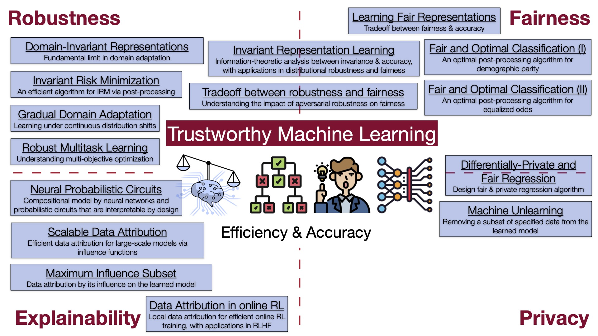

# Trustworthy ML Lab @ UIUC
## Hi there 👋

We are a group of researchers from the University of Illinois Urbana-Champaign, working on machine learning research, aiming to push the frontier of machine learning beyond accuracy and efficiency. A list of topics that we are currently working on includes:

- Distributional robustness: domain adaptation, domain generalization, transfer learning
- Algorithmic fairness: group fairness, post-processing algorithms
- Privacy: intersection between fairness, privacy & robustness, machine unlearning
- Explainability: influence function, Shapley values, data attributions, 
- Probabilistic circuits: expressiveness, neuro-symbolic models, interpretability
- AI for Science: foundation models for geospatial data

An overview of our group's research:

